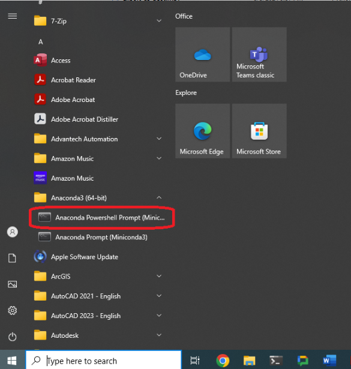

# SICK-Scan-Processing
Python tools for processing scans from the SAFL/NCED Data Carriages.  The tools load data from the processed `.DAT` and `.XML` files and save the output to a geoTIF file that can be opened in ArcGIS or other tools.

## Installing Miniconda and Required Packages
1. Download and Install Miniconda: https://docs.anaconda.com/miniconda/miniconda-install/

2. Clone this Github repository to a directory on your computer. 

3. Open the *Anaconda Powershell Prompt (Miniconda)* (See image below).

4. Change directory to the cloned Github Repository.  (e.g. `cd ./Documents/Github/SICK-Scan-Processing`)

5. Create a miniconda environment using the following command: `conda env create -f sick_processing.yml` and wait for the packages to finish installing. 

## Running the Data Processing Scripts
1. Open the MiniConda PowerShell prompt (if its not already open)

2. Activate the environment for SICK scan processing using the command `conda activate SICK_Processing`

3. Change directory to the cloned Github Repository "SICK-Scan-Processing" (e.g. `cd ./Documents/Github/SICK-Scan-Processing`)

4. Launch the processing script with the command `python Load_Sick.py`

5. The program should open a file selection dialog where you can choose the data you want to process.  A few sample datasets are included here in the "Sample Data" directory. 